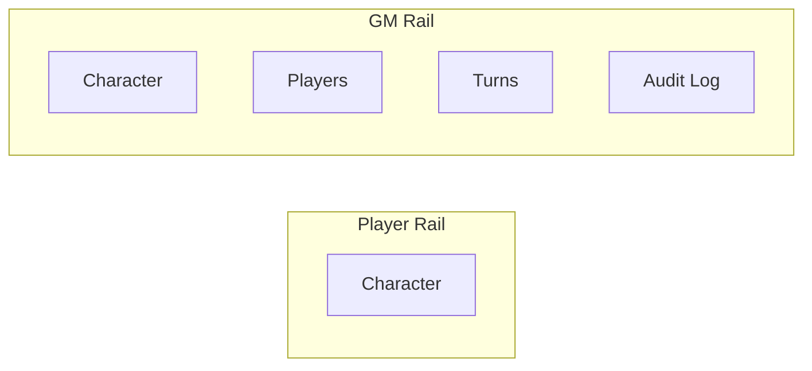
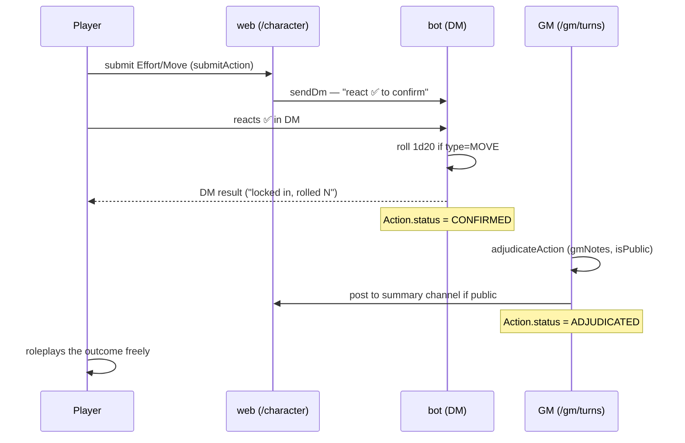

# Lifeweb Web App — Architecture & Redesign Plan

This document turns the working session's design discussion into a single reference: how the turn clock drives the visual theme, how the twice-daily tick actually fires, the navigation/view structure for players vs. GMs, and what's built vs. still missing. It supersedes ad hoc reasoning scattered across the codebase (e.g. the wall-clock-based theme in `HomeScreen.js`, which this doc replaces).

Status snapshot as of writing: character sheets, faction/role sync, tupper proxying, and the full effort/move → DM confirm → dice roll → GM adjudicate → summary-post loop are built and working (see "Turn & Action Lifecycle" below). What's missing is everything about *presentation* (nav shell, GM's three missing views, visual redesign) and *automation* (the tick) and a few small mechanics (resource transfer, needs decay).

---

## 1. Time & the Turn Clock

**Decision: the palette is driven by game state, not the wall clock.**

The single source of truth for "what turn is it" is the `Turn` row with `status = OPEN` in Postgres — `number`, `phase` (`DAWN` | `DUSK`), `gameDate`. Nothing on the frontend should independently guess the time of day.

- `Day N` = `Math.ceil(turn.number / 2)`. Turn 1 = Day 1 Dawn, turn 2 = Day 1 Dusk, turn 3 = Day 2 Dawn, etc.
- Every route needs the open turn to render its theme and turn chip. Add one server-side helper (`web/lib/turn.js`, `getOpenTurn()`) and call it once from the root layout / app shell, passing `phase` down as `data-theme="dawn"|"dusk"` the same way `globals.css` already expects it.
- **This fixes a real bug**: `HomeScreen.js` currently computes `dawn`/`dusk` from `new Date().getHours()` — that's real-world time, completely disconnected from the actual game turn. A GM could close Dusk and open Dawn at 2 AM real time (testing, catch-up, whatever) and the site would still show a dusk palette. Delete `themeForDate`; use the open turn's `phase` everywhere.
- Turn indicator: a small fixed chip — `DAY 3 · DUSK` — bottom-right on desktop, folded into the nav shell on mobile (see §3). Always visible, never buried in a page.

## 2. The Twice-Daily Tick

**Question from the brief: is something constantly polling "is it 5pm yet"? No — it's a scheduled job, not a busy loop.**

`bot/` is the one process in this system that's genuinely always-on (a persistent Railway service, no cold starts, already event-driven for role sync). It should own turn scheduling directly against Postgres — no HTTP hop, no webhook secret to manage, no dependency on the web service being awake.

- Add `node-cron` to `bot/package.json`.
- Two timezone-aware schedules pinned to `America/Chicago` (this automatically handles CST/CDT, no manual DST math): `0 5 * * *` and `0 17 * * *`.
- On fire, run `advanceTurn()` (new: `bot/src/lib/turnEngine.js`, callable from both the cron job and — later — a GM "force advance" button):
  1. If a `Turn` is `OPEN`: apply end-of-turn Needs resolution (§6), then set `status = RESOLVED`.
  2. Open the next `Turn`: `number = last + 1`, `phase` flips, `gameDate` advances once every two turns (Dusk → next Dawn).
  3. Post a short line to the summary channel: `Turn 7 — Dusk falls over Earth.`
- `node-cron`'s internal mechanism is a lightweight once-a-minute check against the cron expression — cheap, and the right level of abstraction here (nobody should hand-roll a `setInterval` comparing hours).
- **Known limitation**: if the bot process restarts right at a boundary, `node-cron` does not "catch up" a missed fire. At this scale (one guild, GM actively watching) that's an acceptable risk, not a reason to build a persistence-backed job queue. The GM dashboard's manual open/close stays as the safety net.
- The GM's existing manual `openTurn()`/`closeTurn()` actions (`web/app/gm/actions.js`) remain for testing and emergency override; production play runs on the cron.

## 3. Navigation Shell

One shell, two renderings of the same component: a left icon rail on desktop, a bottom icon bar on mobile (CSS breakpoint, not a separate implementation). Icons map to real Next.js routes (not client-only view-switching) so URLs are shareable, back/forward works, and each view stays a server component fetching its own data.



- **Players see exactly one icon: Character.** `/character` is still the only screen, but not because every member has a row — they don't. A player with no `ALIVE` character (new to the server, or freshly dead) gets the creation wizard rendered *at* `/character`, inline, rather than being redirected to a separate route. The old `character/new` route is gone. See `CHARACTERS.md`.
- **GMs get four icons**: Character (GMs play characters too), Players, Turns, Audit Log.
- The turn chip (`DAY 3 · DUSK`, §1) lives in the shell chrome, not repeated per-page.
- Routes: `/character` (existing), `/gm/players` (new), `/gm/turns` (new), `/gm/audit` (new). `/gm` itself becomes a redirect to `/gm/players` — the current single-page dashboard gets split across these three.

## 4. View Specs

### Character (`/character` — players and GMs)

Already exists (`web/app/character/page.js`), needs restyling and two additions:

- **Tags grouped by category** — the brief asks for this, but `Tag` has no category field yet. **Schema gap**: add `Tag.category String?` (or an enum once real categories are known) before the grouped UI can exist.
- **Resource ⬢ transfer** — doesn't exist yet. New server action `transferResources(formData)`: validate the sender has enough, the target character exists and is `ALIVE`, decrement/increment both in a transaction, write an `AuditLog` row (`actionType: "resource_transfer"`).
- Role/faction stay read-only, auto-populated from Discord role sync — no manual editing surface, matching "role auto-selected from role."

### GM → Players (`/gm/players`, new)

- Grid/table of every character, filterable by zone and faction (client-side filter over a server-fetched list is fine at this scale — no need for query-param-driven server filtering yet).
- Click a row → expand into that character's full sheet, reusing the Character view component in read-only mode ("see what they see").
- A "Message" button per row → small composer → `sendDm()` (`web/lib/discordGuild.js`, already exists). Because `sendDm` sends from the bot's own account, this **already is** the "anonymous GM / Lifeweb bot" channel the brief describes — no new Discord-side plumbing needed, just a UI for it.

### GM → Turns (`/gm/turns`, new)

- List of every `Action` (Move or Effort), filterable by zone, faction, type, status, turn number. Dice roll shown inline for Moves.
- Row → **Arbitration screen**, a dedicated route/panel (not the current inline `<form>` in the pending-adjudication list) showing full context — character, description, dice, zone — with `gmNotes`, `isPublic`, and submit wired to the existing `adjudicateAction`.
- **Gap**: the brief's step 5 ("GM can additionally send DMs to privately contact any other affected parties") has no UI yet. **Decision: free-pick, not zone-scoped** — the arbitration screen gets a searchable character picker (any character, not just ones sharing a zone with the action) and fires `sendDm` to each selection alongside the public post. Zone-scoping would exclude legitimate cases (a letter to someone in another zone, a rumor reaching a faction leader elsewhere).
- The current "Pending Adjudication" block in `gm/page.js` becomes a small shortcut widget; this view is the full filterable history.

### GM → Audit Log (`/gm/audit`, new)

- Sortable/filterable table over `AuditLog` — filter by `actionType`, actor, target character, date range.
- Current implementation is a hardcoded `take: 50` with no filters or pagination — needs both once this becomes its own view.

### Faction (`/faction`, new — both players and GMs)

- Players: fixed to their own character's faction — member list with name + fate (`Character.status`), the leader's name, the faction's Silo, and their own Resources ⬢.
- GMs: no `factionId` in the URL shows an all-factions overview (member count, leader, Silo, link into each) plus a create-faction form; picking one adds management controls to the same detail view players see — a faction switcher, set-leader per member, add an existing character, remove a member (moves them to Unaffiliated, which never has a leader by design).

## 5. Turn & Action Lifecycle (built, confirmed working)

This is already implemented end-to-end — restyling and the new GM views sit on top of it, nothing here needs re-architecting:



Source: `web/app/character/actions.js` (`submitAction`), `bot/src/events/messageReactionAdd.js` (`handleActionConfirm`), `web/app/gm/actions.js` (`adjudicateAction`).

## 6. Resources ⬢ & Needs

> **Superseded.** This section previously specified a Mood system built on
> `Character.moodState` / `moodExpiresTurn` columns and a set of
> `GameConfig.mood*` knobs. Those columns never existed in the shipped schema
> and the design was replaced: Mood is now two ordinary Status tags riding
> `CharacterTag.expiresTurn` and the existing `resolveNeeds()` sweep. See
> `REQUESTS.md` §4. Hunger shipped on the same pattern (a `hunger` Status tag
> with `durationTurns: 1`, granted by `db/lib/hungerPass.js` from that same
> `resolveNeeds()` hook) — the `GameConfig.hungerMovePenalty` knob this
> section once specified never existed either; the −1 is a module constant in
> `db/lib/gambitModifier.js`.

**Convention: `⬢` is the canonical Resources glyph.** It's placed right after the word "Resources" (or "Silo", see below) wherever a count is shown in the dashboard — status lists, table headers, transfer forms. Keep using it on any new Resources/Silo display rather than introducing a different icon.

**Factions have their own resource pool, the Silo**, separate from a character's personal `resources`. Sending resources to a Faction (via the transfer dropdown on the Character view, which lists both players and factions as recipients) adds the full amount to `Faction.silo` rather than splitting it among members. The Faction view (`/faction`) shows a player their own faction's Silo total alongside their personal Resources ⬢.

## 7. Visual Design System

> **Partly superseded.** The "Ravenheart Underground" pass has since landed the
> token layer, the Tailwind `@theme` bridge, the type scale, the shared-class
> rewrite and the atmosphere layers. The palette brief below is the one part
> that changed direction outright: dawn is no longer a light parchment theme,
> because Ravenheart is underground and a daylight theme contradicts the
> premise — both phases are now darks differing by lamplight temperature, with
> the light theme kept only as the `limestone` comparison backup. Live tokens
> are at the top of `web/app/globals.css`; the conventions are in CLAUDE.md's
> "Web app style conventions". The page-composition pass has since landed too:
> `PageShell`/`PageHeader`/`SkeletonPage`, all 14 skeletons, the 28 section
> headings, the mobile nav "More" sheet, the character sheet's explicit
> columns, and the 120 colour-only inline `style` objects (now `text-muted` /
> `text-accent` / `text-danger` utilities). Two items from that plan were
> deliberately NOT done, with reasons recorded in `globals.css`: `.panel` gets
> no default padding (it is used both as a padded card and as an unpadded
> frame around a table, so a default would inset every table), and limestone's
> raised tier is carried by shadow rather than luminance (its surface is
> already near-white).

There's no "auto-styler" tool for a real codebase the way a one-off page builder works — the equivalent discipline here is a small, deliberate token + component system in Tailwind v4, applied consistently, instead of hand-rolled classes per page (which is what `gm/page.js` and `character/page.js` currently do).

**Removed entirely** (explicit ask — "get rid of the BG sprites," "remove any flavor text B.S.," and this stuff actively works against "must feel fast, not laggy"):
- `PixelScenery.js` and its usage.
- The animated CRT SVG warp filter (`feTurbulence`/`feDisplacementMap`), the 40s/26s infinite gradient-drift animations on `.crt-screen`/`.crt-heading`, and the flicker-animated scanline overlay.
- Flavor copy ("the wind carries dust and old machine-song...", "Enter the Wasteland," "Abandon Post," "Faction Ledger") in favor of literal labels (Sign In, Character, Players, Turns, Audit Log, Sign Out).

**Kept and formalized**:
- Monospace font (IBM Plex Mono, already wired via `next/font`).
- The two-palette concept from `globals.css`, but as flat, static CSS variables per phase — no per-frame animation:
  - **Dawn**: orange → light yellow → orange sky range, dark brass foreground, terracotta accents/borders, cream text.
  - **Dusk**: Caves-of-Qud green → dark grey-green sky range, near-black moss foreground, terracotta accents/borders, cream text.
- ~~A very light, static scanline texture is fine to keep for CRT character (low-opacity, no flicker animation) — it's cheap and doesn't fight responsiveness.~~ **Superseded.** What actually shipped was `.scanlines` at 0.06 opacity, which is invisible on any display while still paying for a full-viewport composited layer. The "Ravenheart Underground" pass replaced it with `.grain` (static SVG turbulence, ~2.5%) and `.vignette`. The CRT direction is parked, not dead — see `CRT-TERMINAL.md`.
- Underline-on-select for interactive options (`.menu-item`'s hover/focus underline already does this — keep the pattern, extend it to nav rail active states).
- One shared component layer instead of per-page hand-rolling: panel/card, button, table, tab/rail item, form field — build once (`web/app/components/ui/`), reuse across Character, Players, Turns, Audit Log.

## 8. Schema Changes Needed

Run these as one migration before building the views that depend on them:

```prisma
model Tag {
  // ...existing fields
  category String?   // new — freeform, not an enum; see below
}
```

`category` is deliberately a plain string, not an enum: the actual tag taxonomy (Skill / Origin / Reputation / whatever) is game content the GM defines by creating tags, not something to hardcode into the schema. The Character view groups tags by whatever distinct `category` values exist among a character's tags, with uncategorized tags falling into a catch-all "Other" group. This unblocks building the grouped UI now without waiting on a finalized taxonomy.

`confirmDmMessageId` and `summaryChannelId` are already in place from the previous pass — no changes needed there.

## 9. Suggested Build Order

1. **Schema**: `Tag.category`, migrate.
2. **Turn-phase plumbing**: `getOpenTurn()` helper, root layout theme binding, turn chip, delete `themeForDate`.
3. **Nav shell**: rail/tab-bar component, route skeletons for `/gm/players`, `/gm/turns`, `/gm/audit`, redirect `/gm` → `/gm/players`.
4. **Visual system**: strip the removed pieces from `globals.css`/`layout.js`, land the static token palettes and shared `ui/` components.
5. **Restyle existing pages** (Character, and the pieces of the old `/gm` page) onto the new shell + components.
6. **Build the three new GM views** (Players, Turns + arbitration screen, Audit Log) for real, including resource transfer and the private-DM-to-affected-parties affordance.
7. **Tick automation**: `node-cron` in `bot/`, `advanceTurn()` with Needs resolution.
8. **Needs mechanics**: hunger/mood decay wired into `advanceTurn()`, dice-roll modifiers. *(Done — both halves resolve in `resolveNeeds()`, and the summed Gambit modifier lives in `db/lib/gambitModifier.js`.)*

Steps 1–5 are the "redo the website" ask and can proceed without further input — all the mechanics decisions above (§6, §4, §8) are resolved in this document rather than left open.
